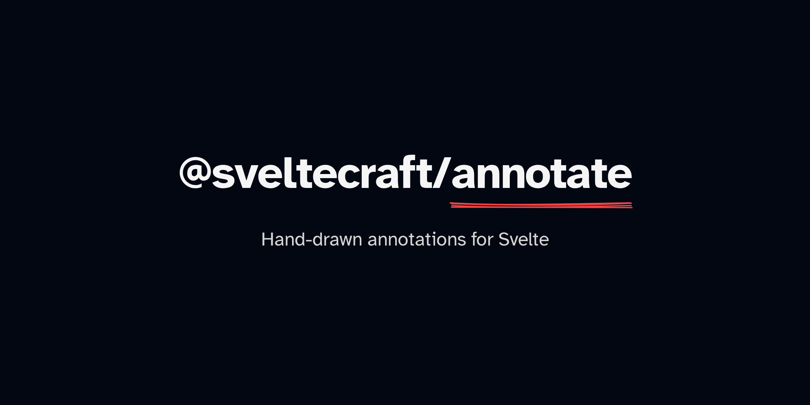

# @sveltecraft/annotate

Hand-drawn annotations for Svelte. Underline, highlight, circle, box, strike, cross off, and bracket your words with sketchy ink that draws itself on.

If you want to create graphics with a hand-drawn, sketchy appearance in Svelte, check out [@sveltecraft/rough](https://github.com/matiadev/svelte-rough).

## Installation

```sh
npm i @sveltecraft/annotate
```

## Quick example

```svelte
<script>
	import { Tween } from 'svelte/motion';
	import { Mark, annotate } from '@sveltecraft/annotate';

	const clock = new Tween(0, { duration: 2000 });
	annotate(clock);
</script>

<button onclick={() => (clock.target = 2)}>draw</button>

<Mark type="underline" color="#f97316" at={0}>underlined text</Mark>
```

## Syntaxes

A mark can be attached, spread onto any element, or written as a component.

### Attach or spread

```svelte
<!-- attach form -->
<span {@attach mark({ type: 'underline', at: 0 })}>text</span>

<!-- spread form, composes with other props -->
<span {...mark({ type: 'underline', at: 0 })}>text</span>
```

### Component

```svelte
<!-- reads the shared clock -->
<Mark type="underline" at={0}>text</Mark>

<!-- explicit clock -->
<Mark mark={other} type="underline" at={0}>text</Mark>

<!-- pick the element -->
<Mark as="a" type="underline" at={0}>text</Mark>

<!-- element ref and attributes -->
<Mark bind:el as="a" href="/docs" type="underline" at={0}>text</Mark>
```

### Your own element

Render your own element and spread the mark onto it:

```svelte
<Mark type="underline" at={0}>
	{#snippet child({ props })}
		<a href="/docs" bind:this={el} {...props}>text</a>
	{/snippet}
</Mark>
```

## Clocks

A clock is just a number that changes over time. Each mark draws from `at` (default `0`) over `span` (default `1`) clock units:

```ts
annotate(2); // fixed number, draws once at full progress
annotate(() => value); // re-read on every update
annotate(tween); // reads tween.current
annotate(timeline); // reads timeline.clock
```

To draw one mark after another, give them different start times. With a clock going `0 → 2`:

```svelte
<Mark type="underline" at={0} span={1}>draws first</Mark>
<Mark type="underline" at={1} span={1}>draws second</Mark>
```

Before `at` the mark is invisible, after `at + span` it is fully drawn.

## Multiple clocks

`<Mark>` needs a clock to draw against. One `annotate` call sets it for every plain `<Mark>`. For multiple clocks, use `annotate.scoped` and pass it along (`mark={...}` on `<Mark>`, or call it directly in spread form):

```svelte
<script>
	import { Tween } from 'svelte/motion';
	import { Mark, annotate } from '@sveltecraft/annotate';

	const clockA = new Tween(0, { duration: 2000 });
	const clockB = new Tween(0, { duration: 2000 });

	const markA = annotate.scoped(clockA);
	const markB = annotate.scoped(clockB);
</script>

<button onclick={() => (clockA.target = 2)}>draw A</button>
<button onclick={() => (clockB.target = 2)}>draw B</button>

<Mark mark={markA} type="underline" at={0}>clock A</Mark>
<Mark mark={markB} type="underline" at={0}>clock B</Mark>

<!-- spread form is always scoped -->
<span {...markA({ type: 'underline', at: 0 })}>clock A</span>
```

With no clock at all, `<Mark>` throws and tells you the one line to add.

## Options

| Option        | Default                 | Meaning                                                                               |
| ------------- | ----------------------- | ------------------------------------------------------------------------------------- |
| `type`        | required                | `underline`, `box`, `circle`, `highlight`, `strike-through`, `crossed-off`, `bracket` |
| `color`       | `currentColor`          | stroke color                                                                          |
| `padding`     | `5` (`12` for brackets) | gap around the text, number or per side                                               |
| `strokeWidth` | `2.5`                   | line thickness, ignored by `highlight`                                                |
| `roughness`   | `1.6`                   | wobble, `0` is straight                                                               |
| `seed`        | `7`                     | fixed so repaints don't reshuffle                                                     |
| `iterations`  | `2`                     | stroke passes                                                                         |
| `rtl`         | `false`                 | draw right to left                                                                    |
| `brackets`    | `['right']`             | sides drawn for `bracket`                                                             |
| `multiline`   | `false`                 | one mark per line instead of one around all lines                                     |
| `at`          | `0`                     | clock value where the draw starts                                                     |
| `span`        | `1`                     | clock units the draw takes                                                            |

`<Mark>` takes the same options as props, plus `mark` for an explicit clock, `as` to pick the element (default `span`), `bind:el` for a reference to that element, `child` for a snippet that renders your own element, and `class` plus any other element props (`id`, `style`, `data-*`, handlers) passed through to that element.

The `child` snippet receives a `props` object holding the annotation plus everything passed to `<Mark>`, so spread it onto your element. The element you render is the one measured and annotated, and `bind:this` on it is your element reference.
